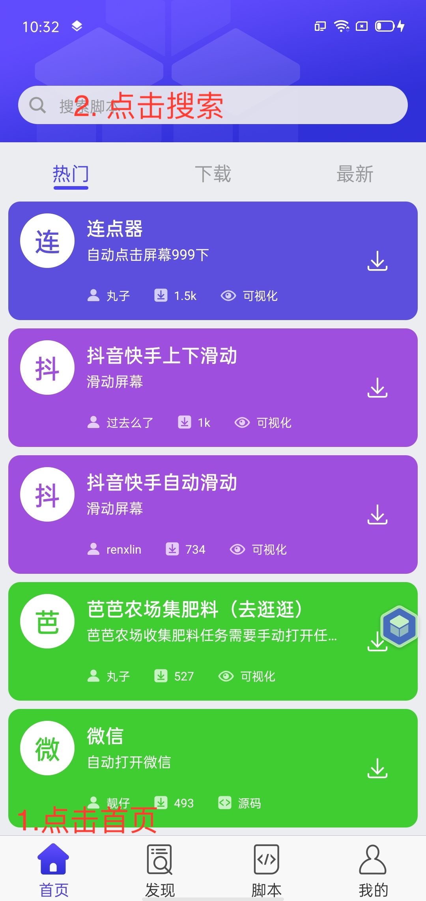
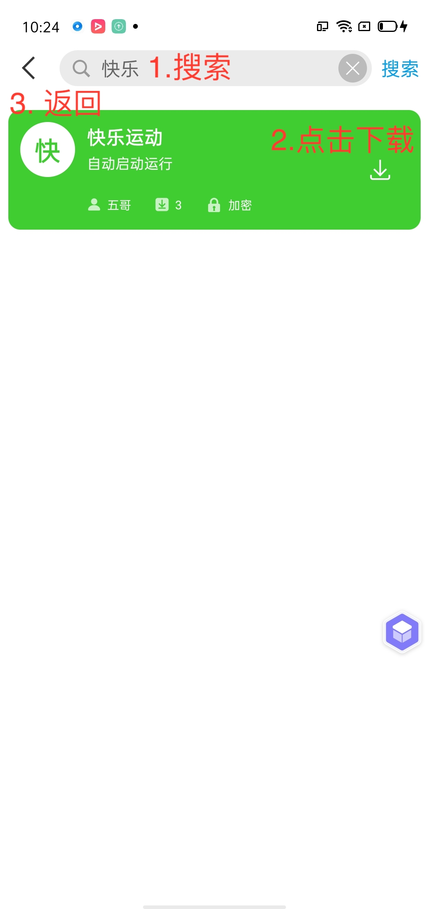
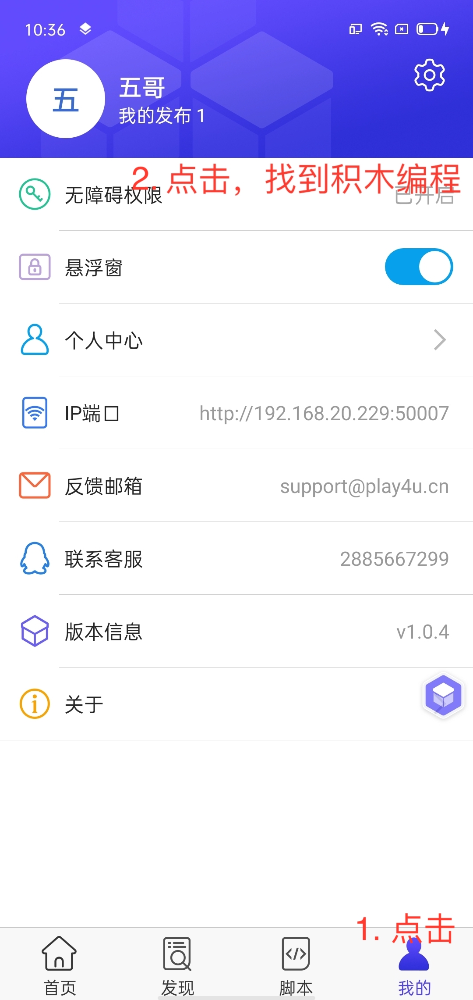
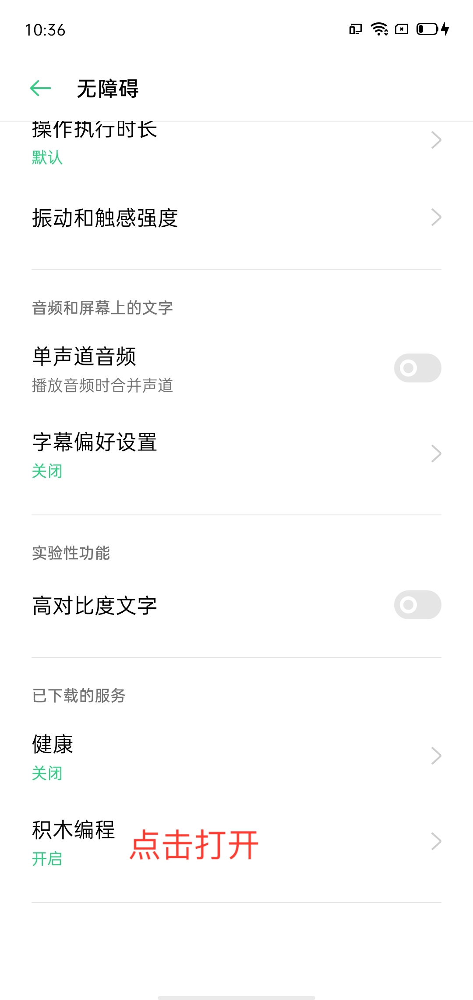
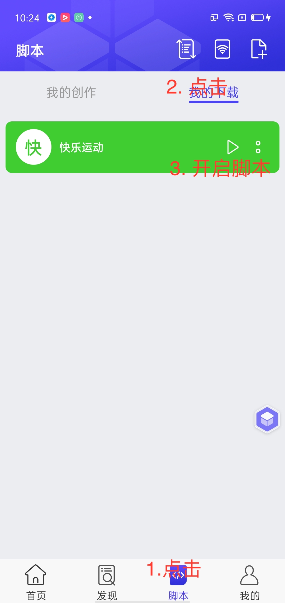
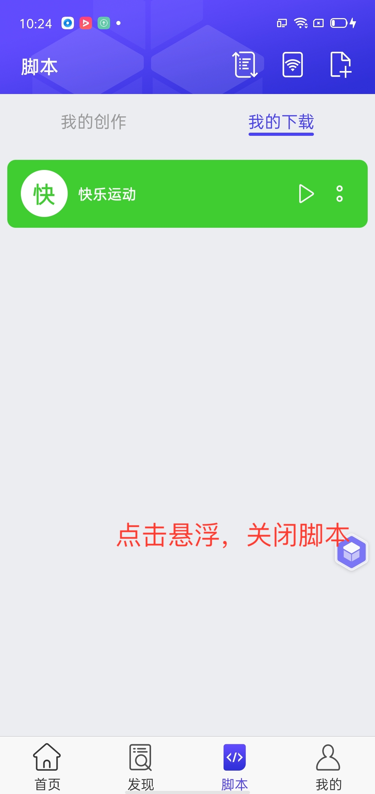

# 使用教程

使用手机浏览器打开链接，不要在微信里打开。

## 快乐运动

__下载快乐运动 [点击打开链接，点击开始运动下载](https://sport.yuekun.net)，注册并登录。__

app，首页右上角进入，可以看广告赚钱。

__使用下面的软件可以自动看广告，不需要人工操作。__

## 使用脚本自动刷广告

__下载 积木编程 [点击打开链接，点击下载客户端下载](https://www.touchsprite.com/luabox)，注册并登录。__

### 1. 打开 __积木编程__ 搜索

### 2. 搜索 快乐运动 下载脚本

### 3. 开启权限

### 4. 设置 > 无障碍权限。找到积木编程，打开权限

### 5. 返回 积木编程App 打开脚本

### 6. 关闭脚本

- 关闭脚本：点击悬浮窗口就会关闭脚本。

- 开启脚本：点击悬浮窗口，我的下载，点击开始运行脚本。

